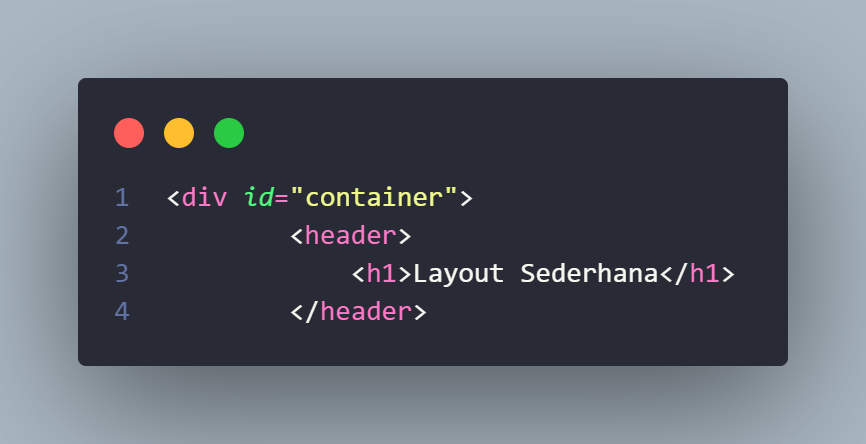

# Pratikum4 - HTML - CSS

=========================================================================== 

 &#128640 <b>NAMA          :  CHAERUL HIDAYAT</b>&#128640   
  &#128640<b>NIM           :  312210300</b>&#128640  
 &#128640<b>Mata Kuliah   :  Pemrograman Web</b>&#128640  

===========================================================================  

1. Pertama saya membuat Tag Html biasa , dengan menggunakan tag div  dengan class container dengan tag h1  seperti gambar di bawah ini  
  
dan ini CSS nya untuk container nya  
  
dan ini adalah hasil tampilan nya  
 
2. Saya membuat tag nav yang yang berisi Home, Artikel, About, Kontak sesuai gambar di bawah ini  
  
dan ini adalah CSS nya pada tag navigasi  
  
dan ini adalah hasil tampilan nya  
  

3. Saya membuat tag section dengan class hero yang isi di dalam section ada h1 dan p  
  
dan ini CSS section hero nya  
  
dan ini adalah hasil tampilan nya  
 
4. Saya membuat tag  beberapa tag section  dengan class wrapper dan class main yang di dalam section ada div  
 
dan ini adalah CSS nya  

Dan ini adalah hasil tampilan web nya  
 
5. Saya membuat tag section dengan class sidebar di dalam ny ada tag h2, img   
 
dan ini lah CSS nya  
  
dan ini adalah hasil nya  
 
6. saya membuat tag article dengan class entry  
  
dan ini adalah CSS nya  
 
 
dan ini adalah hasil tampilan Web nya  

7. selanjut nya saya menambahkan tag footer  
 
dan ini adalah CSS nya  
 
dan ini tampilan footer nya  
 
=========================================================================  
=========================================================================  
Dan sekarang saya akan buat Box Element  
Di sini saya buat tag header yang di dalam nya ada h1 dan di bawah nya ada tag Section  
 
dan ini adalah CSS nya  
 
dan ini adalah hasil nya  
 
=========================================================================  
=========================================================================  
Di sini saya buat layout tentang About Us, yang berisi Portfolio , 
di dalam nya ada div dengan class container , ada header, ada section dengan class hero dan ada footer  
 
dan ini adalah CSS nya  
 
 
 
 
Dan ini adalah tampilan nya  
 
========================================================================  
========================================================================  
Di sini saya membuat halaman Contact Us yang berisi Nama , Email, No hp, Message  
di dalam nya ada tag h1 , tag div dengan class container yang di dalam nya ada tag form dan label  
 
dan ini adalah css nya  
 
Dan ini adalah tampilan layout nya  
  
=========================================================================== 

 &#128640 <b> Terima Kasih </b>&#128640  

=========================================================================== 

